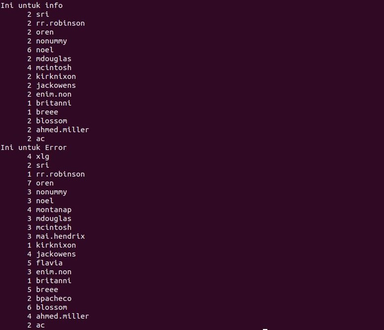

# soal-shift-sisop-modul-1-B09-2021

* Vincent Yonathan    - 05111940000186
* Aprilia Annisa      - 05111940000199
* Pramudityo Prabowo  - 05111940000210

### Soal Modul 1
[Soal Shift Modul 1](https://docs.google.com/document/d/1T3Y4o2lt5JvLTHdgzA5vRBQ0QYempbC5z-jcDAjela0/edit)

### Daftar isi
* [Soal 1](#soal-1)
* [Soal 2](#soal-2)
* [Soal 3](#soal-3)


### Soal 1
*Praktikan* diminta untuk membuat laporan harian perusahaan untuk aplikasi internal perusahaan, *ticky*. Ada 2 macam laporan yang harus dibuat yaitu laporan **daftar peringkat pesan error** terbanyak yang dibuat oleh *ticky* dan laporan **penggunaan user** pada aplikasi *ticky*.  

#### 1. a)
*Praktikan* diminta untuk mengumpulkan informasi berupa: jenis log (`ERROR`/`INFO`), pesan log, dan username pada file `syslog.log` untuk setiap baris *log*nya.&nbsp;

#### Source Code :
```bash
#!/bin/bash

#1.a)
errorinfo=$(grep -o "[INFO|ERROR].*" syslog.log)
echo "$errorinfo"
```
- Pengerjaan menggunakan regex `[INFO|ERROR].*` yang mengambil baris dari `syslog.log` dengan kata-kata tersebut untuk dimunculkan di output.  

#### Contoh Output :
```
INFO closed ticket [#1754] (noel)
ERROR ticket doesn't exist (xlg)
```


#### 1. b)
*Praktikan* diminta menampilkan semua pesan error yang muncul beserta jumlah kemunculannya dari `syslog.log`&nbsp;
#### Source Code :
```bash
errorcount=$(grep -o "ERROR.*" syslog.log |sort -nr | cut -d "(" -f1 | uniq -c)
echo $errorcount
```
- Melakukan `grep -o` pada `syslog.log` untuk mem*filter* dan mencetak baris eksplisit yang sesuai dengan regex yang diminta/tidak mencetak seluruh baris.
- Menggunakan *regex* `ERROR.*` yang mengambil baris berisikan `(ERROR)` pada kata depannya.
- Melakukan sorting atau pengurutan menggunakan command `| sort` yang mengurutkan seluruh baris dengan konten kata yang sama, hasilnya akan seperti berikut
```
ERROR Tried to add information to closed ticket (sri)
ERROR Tried to add information to closed ticket (oren)
ERROR Tried to add information to closed ticket (oren)
ERROR Tried to add information to closed ticket (nonummy)
ERROR Tried to add information to closed ticket (noel)
... dst
```
- Menggunakan command `| cut -d` yang berarti cut dengan delimiter `"(" -f1` yang berarti mengambil semua sampai dengan sebelum `(nama-pengguna)`
- Terakhir, menggunakan command `| uniq -c` dimana `uniq` berarti mengelompokan dan `-c` yang berarti menghitung baris sehingga diketahui jumlah setiap error.&nbsp;
#### Output :
```
12 ERROR Tried to add information to closed ticket 
15 ERROR Timeout while retrieving information 
 7 ERROR Ticket doesn't exist 
 9 ERROR The ticket was modified while updating 
10 ERROR Permission denied while closing ticket 
13 ERROR Connection to DB failed 
```


#### 1. c)
*Praktikan* diminta untuk  menampilkan jumlah kemunculan log `ERROR` dan `INFO` untuk setiap *user*-nya.&nbsp;

#### Source Code :
```bash
uinforegex=$(grep "INFO.*" syslog.log | cut -d "(" -f2 | cut -d ")" -f1| sort -nr | uniq -c)
uerroregex=$(grep "ERROR.*" syslog.log | cut -d "(" -f2 | cut -d ")" -f1 | sort -nr | uniq -c)
echo "$uinforegex"
echo "$uerroregex"
```
- Menggunakan command `grep` untuk mengambil baris dari file `syslog.log`
- Melakukan filter yaitu dengan menggunakan *regex* `INFO.*` dan `ERROR.*` yang bertujuan untuk mengambil baris dengan kata `(INFO)` dan `(ERROR)`
- Menggunakan command `| cut -d` yang berarti cut dengan delimiter `"(" -f2` yang berarti memotong sampai dengan sebelum `(nama-pengguna)` 
- Sekali lagi menggunakan command `| cut -d` namun dengan delimiter `")" -f1` yang berarti memotong semua kalimat sampai dengan akhir setelah `(nama-pengguna)` agar yang tercetak hanya nama pengguna
- Kemudian, melakukan `sort` untuk mengurutkan tiap baris dengan konten yang sama
- Terakhir, menggunakan command `| uniq -c` dimana `uniq` berarti mengelompokan dan `-c` yang berarti menghitung baris sehingga diketahui jumlah setiap error.&nbsp;

#### Output :
```bash
untuk info
      2 sri
      2 rr.robinson
      2 oren
      2 nonummy
 .. dst
 untuk error
      4 xlg
      2 sri
      1 rr.robinson
      7 oren
..dst
```


#### 1. d)
Menuliskan informasi pada poin **b** kedalam file error_message.csv. Header adalah Error,Count dengan daftar pesan error dan jumlah kemunculannya diurutkan dari yang terbanyak.&nbsp;

#### Source Code :
```bash
grep -o "ERROR.*" syslog.log | sed 's/\<ERROR\>//g' | cut -d "(" -f1 | sort | uniq -c |
while read count msg
do
        echo $msg,$count
done | sort -nr -t, -k2 | sed '1i\Error,Count' > error_message.csv
```
- Menggunakan cara yang sama dengan poin b yaitu melakukan `grep -o` pada `syslog.log` dan menggunakan *regex* `ERROR.*` untuk memfilter isinya.
- Kemudian pada soal ini ditambahkan command `| sed 's/\<ERROR\>//g'` untuk menghilangkan kata ERROR dan mengambil sisa dari baris tersebut. 
- Setelah itu, melakukan hal yang sama yaitu menggunakan command `| cut -d` yang berarti cut dengan delimiter `"(" -f1` dan command `uniq -c`
- Kemudian, pada poin ini, program akan melakukan iterasi dengan command `| while read count msg` yang menyimpan nilai jumlah kemunculan pesan info dan kalimatnya ke dalam variabel `'count'` dan `'msg'`
- Melakukan echo dengan posisi `$msg,$count` agar disesuaikan dengan permintaan soal
- Berikutnya, melakukan sorting sekali lagi menggunakan command `| sort -nr -t, -k2` yaitu melakukan sort secara *descending* dan memberitahu bahwa yang di sort adalah kolom kedua.
- Terakhir, untuk memberikan header menggunakan command `| sed '1i\Error,Count' > error_message.csv` dan mengeluarkan outputnya pada file error_message.csv dan menimpa apapun yang ada disana dengan command `> error_message.csv`.&nbsp;

#### Output :


#### 1. e)
Menuliskan informasi pada poin **c** kedalam file user_statistic.csv dengan header 'Username, INFO, ERROR' diurutkan berdasarkan username secara *ascending*.&nbsp;

#### Source Code :
```bash
echo "Username,INFO,ERROR" > user_statistic.csv

cut -d "(" -f2 syslog.log | cut -d ")" -f1 | sort -t , -k1 | uniq |
while read line;
do
        info=$(grep "INFO.*($line)" syslog.log | wc -l)
        error=$(grep "ERROR.*($line)" syslog.log | wc -l)
        echo -e "$line,$info,$error"
done >> user_statistic.csv
```
- Menggunakan `echo "Username, INFO, ERROR"` sebagai header dari file yang akan mencetak output, `echo` akan berjalan ke user_statistic.csv lewat `> user_statistic.csv`.
- Melakukan langkah yang sama dengan bagian **c** yaitu menggunakan command `| cut -d` yang berarti cut dengan delimiter `"(" -f2` dan sekali lagi menggunakan `| cut -d` namun dengan delimiter `")" -f1` untuk mengambil hanya nama dari penggunanya
- Kemudian juga melakukan sort, namun yang disort adalah kolom 1 dengan command `| sort -t, -k1` yang berarti diurutkan berdasarkan kolom 1 dan dengan pemisah `,`. Setelah itu dilakukan pengelompokan yang menggunakan command `uniq`
- Setelah itu melakukan iterasi dengan command `| while read line` yang menyimpan nama dari pengguna dalam variabel line
- Menggunakan command `grep` untuk memfilter file `syslog.log` dengan regex `INFO.*($line)` dan `ERROR.*($line)` yang berarti mengambil baris yang berisi `(INFO)` dan `(ERROR)` dengan nama dari user yang sedang dibaca melalui iterasi. 
- Setelah melakukan `grep`, juga digunakan command `wc -l` untuk menghitung banyaknya line sehingga mengetahui berapa banyak `(INFO)` dan `(ERROR)` dari seorang pengguna.
- Langkah berikutnya adalah menggunakan command `echo -e "$line,$info,$error` untuk mencetak hasil sesuai urutan yang diminta oleh soal, kemudian mencetaknya kedalam user_statistic.csv melalui command `>> user_statistic.csv`, disini digunakan `>>` agar tidak menimpa `echo` pertama pada header.

#### Output :


---

### Soal 2
*Praktikan* mampu mencari data dari laporan *Laporan-TokoShiSop.tsv* yang akan diselesaikan terdapat dalam soal nomor 2a, 2b, 2c, dan 2d. Kemudian untuk pengerjaan script soal dikerjakan di file yang diberi nama dengan **soal2_generate_laporan_ihir_shisop.sh** dan hasil kesimpulan akan disimpan kedalam script yang bernama **hasil.txt**.
```bash
export LC_ALL=C
```
Menggunakan `LC_ALL=C` untuk membaca file agar data yang ada di *Laporan-TokoShiSop.tsv* lebih akurat.
```bash
awk ' '
```
Menggunakan `awk ''` untuk menyelesaikan soal sehingga harus mengimport `awk ''` terlebih dahulu di awal pengerjaan **shell script**
```bash
FS="\t"
```
Penggunaan pada `FS="\t"` untuk membaca setiap kolom yang ada di file *Laporan-TokoShiSop.tsv* dipisahkan oleh *tab*.
```bash
BEGIN
```
`BEGIN` adalah sebuah blok yang hanya akan dieksekusi satu kali, yaitu sebelum input dari program dibaca.
```bash
END
```
`END` adalah sebuah blok yang hanya dieksekusi satu kali, yaitu hanya setelah semua input dari program selesai dibaca.


#### 2.a)
*Praktikan* mampu mencari **Row ID** dan **Profit Percentage terbesar**. Pencarian *profit percentage terbesar* didefinisikan dengan `Profit Percentage = (Profit / Cost Price) x 100` yang dimana Cost Price didapatkan dari pengurangan Sales dengan Profit. **(Quantity diabaikan)**.&nbsp;

#### Source Code :
- Penginisialisasian terhadap setiap elemen kolom yang digunakan
```bash
 rowID=$1
 profit=$21
 sales=$18
```
Pada penginisialisasian kolom disini menggunakan nama variabel baru sesuai dengan nama kolom dan urutan yang ada di *Laporan-TokoShiSop.tsv*.&nbsp;

- Menghitung `Profit Percentage`
```bash
profit_percentage=(profit/(sales-profit))*100
```
Untuk menghitung **Profit Percentage** sesuai dengan pendefinisian rumus awal, maka kita harus mendapatkan nilai profit yang ada di kolom data urutan **$21** dan sales di kolom urutan **$18**. Lalu untuk pencarian nilai **Cost Price** adalah dengan pengurangan Sales dikurangkan dengan profit. Kemudian hasil pembagian dari **Profit** dan **Cost Price** dikalikan dengan 100.&nbsp;

- Mendapatkan nilai dari `Profit Percentage` terbesar
```bash
if (profit_percentage >= maks){
   maks=profit_percentage
   maksID=rowID
}
```
Untuk mencari nilai `Profit Percentage` terbesar adalah dengan membandingkan nilai `Profit Prcentage` disetiap barisnya dengan nilai `maks` dimana untuk awal perbandingan nilainya akan bernilai 0. Lalu jika disetiap perbandingan nilai `Profit Percentage` lebih besar daripada maks, maka maks akan terupdate dengan nilai yang baru. Lalu gunakan `maksID=rowID` untuk menyimpan ID yang terbesar.&nbsp;

```bash
printf ("Transaksi terakhir dengan profit percentage terbesar yaitu %d dengan persentase %d%%.\n", maksID, maks)
```
Mencetak nilai dari *maksID* dan *maks* sesuai dengan format di atas.


#### 2.b)
*Praktikan* mampu mencari daftar **Nama Customer** yang bertransaksi pada tahun **2017** dan di kota **Albuquerque**.&nbsp;

#### Source Code :
- Penginisialisasian terhadap setiap elemen kolom yang digunakan
```bash
year=$2
city=$10
name=$7
```
Pada penginisialisasian kolom disini menggunakan nama variabel baru sesuai dengan nama kolom dan urutan yang ada di *Laporan-TokoShiSop.tsv*.&nbsp;

- Mendapatkan **Nama Customer** yang melakukan transaksi pada tahun **2017** dan di kota **Albuquerque**
```bash
if (year~"2017" && city=="Albuquerque"){
   list[name]+=1
}
```
Pada if saat ini digunakan untuk pengecekan Customer yang melakukan transaksi pada tahun 2017 dan di kota Albuquerque. Pada `awk` akan melakukan pengecekan pada setiap baris di dalam file, dimana akan mencari data dari kolom ke **$2** yang mengandung string "2017" dan di kolom ke **$10** yang mengandung string "Albuquerque". Ketika dalam melakukan pengecekan disetiap barisnya dan mendapatkan tahun dan kota yang diinginkan maka nama customer akan disimpan ke dalam array name. Pencarian akan dilakukan sampai data telah semuanya di cek.&nbsp;

```bash
 printf ("Daftar nama customer di Albuquerque pada tahun 2017 antara lain:\n")
    for (data in list){
    printf ("%s\n", data)
}
```
Melakukan iterasi untuk menampilkan semua nilai yang ada di array name atau **Nama Customer**.


#### 2.c)
*Praktikan* mampu mencari salah satu **Segment** dan **Jumlah transaksinya yang paling sedikit** dimana setiap segmentnya terdapat : Home Office, Customer dan Corporate.&nbsp;

#### Source Code :
- Penginisialisasian terhadap setiap elemen kolom yang digunakan
```bash
segment=$8
```
Pada penginisialisasian kolom disini menggunakan nama variabel baru sesuai dengan nama kolom dan urutan yang ada di *Laporan-TokoShiSop.tsv*.&nbsp;

- Menghitung banyaknyanya **Segment** yang muncul di *Laporan-TokoShiSop.tsv*
```bash
if (segment=="Consumer"){
   hitung[segment]+=1
}
else if (segment=="Corporate"){
   hitung[segment]+=1
}
else if (segment=="Home Office"){
   hitung[segment]+=1
}
```
Melakukan pengecekan pada kolom ke **$8** yang diinisialisasi dengan variabel *segment*. Lalu `awk` mengecek setiap baris di dalam file di setiap menemukan salah satu dari *segment* maka nama dan nilai dari segment akan dimasukkan kedalam array disetiap segmentnya. Perhitungan akan dilakukan sampai setiap *segment* telah di cek dan dijumlahkan.&nbsp;

- Mencari **segment** dan **Jumlah transaksi yang paling sedikit**
```bash
 transaksi=99999
 for (n in hitung){
   if (hitung[n]<transaksi){
       transaksi=hitung[n]
       nama_segment=n
   }
 }
```
Iterasi pada array untuk mencari jumlah yang paling sedikit. Dimana jumlah *segment* akan dibandingkan untuk pertama kali yaitu dengan *transaksi=99999* supaya nilai hitung *segment* selalu lebih kecil daripada *transaksi=99999*. Setelah dibandingkan dan jumlahnya lebih kecil maka nilai transaksi akan terupdate menjadi nilai lebih kecil dan nama *segment* mengikuti nama *segment* yang sedang dibandingkan.&nbsp;
```bash
printf ("\n\nTipe segmen customer yang penjualannya paling sedikit adalah %s dengan %d transaksi.\n\n", nama_segment, transaksi)
```
Mencetak nilai dari *nama_segment* dan *transaksi* sesuai dengan format di atas.


#### 2.d)
*Praktikan* mampu mencari **Wilayah bagian (region) yang memiliki total keuntungan (profit) yang paling sedikit** dan **Total keuntungan wilayah tersebut** dimana setiap regionnya : Central, East, South, dan West.

- Penginisialisasian terhadap setiap elemen kolom yang digunakan
```bash
 wilayah=$13
 profit=$21
```
Pada penginisialisasian kolom disini menggunakan nama variabel baru sesuai dengan nama kolom dan urutan yang ada di *Laporan-TokoShiSop.tsv*.&nbsp;

- Menghitung **Total Keuntungan** dari setiap wilayah
```bash
if (wilayah=="Central"){
   jumlah[wilayah]+=profit
}
else if (wilayah=="East"){
   jumlah[wilayah]+=profit
}
else if (wilayah=="South"){
   jumlah[wilayah]+=profit
}
else if (wilayah=="West"){
   jumlah[wilayah]+=profit
}
```
Melakukan pengecekan pada kolom ke **$13** yang diinisialisasi dengan variabel *wilayah* dan kolom ke **$21** yang diinisialisasi dengan variabel *profit*. Lalu `awk` akan mengecek setiap baris di dalam file, disetiap menemukan salah satu dari *wilayah* maka nama dan *profit* dari *wilayah* akan dimasukkan kedalam array disetiap wilayahnya. Perhitungan akan dilakukan sampai setiap *wilayah* telah di cek dan *profit*nya akan dijumlahkan.&nbsp;

- Mencari **Wilayah yang totalnya paling sedikit** dan **Jumlah transaksinya**
```bash
minimal_profit=99999
for (x in jumlah){
  if (jumlah[x]<minimal_profit){
     minimal_profit=jumlah[x]
     nama_wilayah=x
  }
}
```
Iterasi pada array untuk mencari jumlah *profit* yang paling sedikit. Dimana jumlah *profit* disetiap *wilayah* akan dibandingkan untuk pertama kali yaitu dengan *minimal_profit=99999* supaya nilai hitung jumlah *profit* selalu lebih kecil daripada *minimal_profit=99999*. Setelah dibandingkan dan jumlah *profit*nya lebih kecil maka nilai minimal_profitnya akan terupdate menjadi *profit* lebih kecil dan nama *wilayah* mengikuti nama *wilayah* yang sedang dibandingkan.&nbsp;
```bash
 printf ("Wilayah bagian (region) yang memiliki total keuntungan (profit) yang paling sedikit adalah %s dengan total keuntungan %.2f.\n", nama_wilayah, minimal_profit)
```
Mencetak nilai dari *nama_wilayah* dan *minimal_profit* sesuai dengan format di atas.

#### 2.e)
Untuk memanggil direktori dan hasilnya akan dipush kedalam file **hasil.txt** seperti dibawah ini :&nbsp;
```bash
Laporan-TokoShiSop.tsv > hasil.txt
```
Hasil dari kesimpulan dari data yang dicari di dalam file **hasil.txt**.&nbsp;
#### Output :


---

### Soal 3
#### 3.a)

*Praktikan* diminta untuk membuat script untuk **mengunduh** 23 gambar dari *"https://loremflickr.com/320/240/kitten"* serta **menyimpan** log-nya ke file `Foto.log`. Agar file yang di download tidak terunduh lebih dari sekali, *Praktikan* juga harus menghapus gambar yang sama kemudian **menyimpan** gambar yang telah disimpan dengan nama `Koleksi_XX` dengan nomor yang berurutan **tanpa ada nomor yang hilang**.

#### Source Code :
```bash
#!/bin/sh

echo  "" > Foto.log
for  i  in {1..23}; do
wget https://loremflickr.com/320/240/kitten -O $( printf "Koleksi_%02d" $i) -a Foto.log
done

for  ((i =  1 ; i <  24 ; i++)); do
for  ((j = i +  1 ; j <  24 ; j++)); do
if diff $( printf "Koleksi_%02d" $i)  $( printf "Koleksi_%02d" $j) &> /dev/null; then
rm $( printf "Koleksi_%02d" $j)
fi
done
done

  

for  i  in {1..23}; do
if [ ! -f $( printf "Koleksi_%02d" $i ) ]; then
for  ((j =  23; i < j; j--)); do
if [ -f $( printf "Koleksi_%02d" $j ) ]; then
mv $( printf "Koleksi_%02d" $j )  $( printf "Koleksi_%02d" $i )
break
fi
done
fi
done
#!
```
- Pertama file didownload menggunakan `wget` lalu namanya disesuaikan dengan `-o` dan log dari file dimasukkan ke `Foto.log` dengan `-a`
-  Kedua file di cek kesamaan nya dengan menggunakan variabel `I` dan `J`. **Jika file yang dicek merupakan file yang sama**, file akan di remove `-rm`
- Ketiga file dicek urutan nya nya dengan menggunakan variabel `I` dan `J`.  **jika ada file yang tidak ada**, script akan mengecek dari belakang koleksi yang ada dan mengganti namanya ke file yang tidak ada tersebut untuk melengkapi keterurutan menggunakan `-mv`

#### Contoh Output


#### 3.b)
*Praktikan* diminta untuk membuat script untuk **mengunduh gambar setiap hari pada jam 8 malam** untuk tanggal-tanggal tertentu setiap bulan, yaitu dari **tanggal 1 setiap 7 hari sekali** serta dari **tanggal 2 setiap 4 hari sekali**. Agar lebih rapi gambar yang telah diunduh beserta **log-nya, dipindahkan ke folder** dengan nama **tanggal unduhannya** dengan **format** `DD-MM-YYYY`.

#### Source Code :
```bash
#!/bin/bash
cd /home/prk/soal-shift-sisop-modul-1-B09-2021-main/soal3
echo  "" > Foto.log
for  i  in {1..23}; do
wget https://loremflickr.com/320/240/kitten -O $( printf "Koleksi_%02d" $i) -a Foto.log
done

for  ((i =  1 ; i <  24 ; i++)); do
for  ((j = i +  1 ; j <  24 ; j++)); do
if diff $( printf "Koleksi_%02d" $i)  $( printf "Koleksi_%02d" $j) &> /dev/null; then
rm $( printf "Koleksi_%02d" $j)
fi
done
done

for  i  in {1..23}; do
if [ ! -f $( printf "Koleksi_%02d" $i ) ]; then
for  ((j =  23; i < j; j--)); do
if [ -f $( printf "Koleksi_%02d" $j ) ]; then
mv $( printf "Koleksi_%02d" $j )  $( printf "Koleksi_%02d" $i )
break
fi
done
fi
done

target="$(date +%d)-$(date +%m)-$(date +%Y)"
mkdir $target
mv Koleksi_* $target
mv Foto.log $target
```
- Tanggal ditetapkan dalam **target**
- Foto yang telah dibuat dimasukkan kedalam folder setelah folder dibuat `mkdir $target`
-  `Koleksi_XX` dan `Foto.log` dimasukkan ke dalam folder `$target`

#### Contoh Output
.JPG)

#### Crontab
```
00 20 1-31/7 * * /bin/bash /home/prk/soal-shift-sisop-modul-1-B09-2021-main/soal3/soal3b.sh
00 20 2-31/4 * * /bin/bash /home/prk/soal-shift-sisop-modul-1-B09-2021-main/soal3/soal3b.sh
```
- Dengan adanya cron diatas, proses output akan diulang setiap 7 hari setelah tanggal 1, dan setiap 4 hari setelah tanggal 2
  
  #### Contoh Output


#### 3.c)
*Praktikan* diminta untuk membuat script untuk menambahkan **kelinci** kedalam list yang **diunduh** lalu foto yang diunduh berubah secara **bergantian**. untuk membedakan folder, folder diberi nama `Kucing_XX` atau `Kelinci_XX`.
#### Source Code
```bash
#!/bin/sh
echo  "" > Foto.log
today=$(date "+%d")
let hasil=$today%2
#mengetahui tanggal dan menentukan kucing atau kelinci

if [ $hasil -eq 0 ]
then
kitten=1
else
kitten=0
fi
  
for  ((i =  1; i <  24 ; i++)); do
if [[ $kitten == 1 ]]; then
wget https://loremflickr.com/320/240/kitten -O $( printf "Koleksi_%02d" $i) -a Foto.log
fi
if [[ $kitten == 0 ]]; then
wget https://loremflickr.com/320/240/bunny -O $( printf "Koleksi_%02d" $i) -a Foto.log
fi
done
  
for  ((i =  1 ; i <  24 ; i++)); do
for  ((j = i +  1 ; j <  24 ; j++)); do
if diff $( printf "Koleksi_%02d" $i)  $( printf "Koleksi_%02d" $j) &> /dev/null; then
# diff evaluated true if file matches
rm $( printf "Koleksi_%02d" $j)
fi
done
done
  
for  i  in {1..23}; do
if [ ! -f $( printf "Koleksi_%02d" $i ) ]; then
for  ((j =  23; i < j; j--)); do
if [ -f $( printf "Koleksi_%02d" $j ) ]; then
mv $( printf "Koleksi_%02d" $j )  $( printf "Koleksi_%02d" $i )
break
fi
done
fi
done   

if [[ $kitten == 1 ]]; then
target="Kucing_$(date +%d)-$(date +%m)-$(date +%Y)"
fi
if [[ $kitten == 0 ]]; then
target="Kelinci_$(date +%d)-$(date +%m)-$(date +%Y)"
fi

mkdir $target
mv Koleksi_* $target
mv Foto.log $target
```
- Tanggal yang dimasukkan kedalam `today`
- `today` diproses dengan mod 2, jika hasilnya 0 maka `Kitten` dijadikan **true**. Jika hasil dari `today` tidak 0, maka `kitten` menjadi **False**
- Proses dari pengambilan gambar sama seperti 3a, hanya link dan proses pemilihan link menyesuaikan hasil dari `today`.

#### 3.d)

  

#### 3.e)
